# Striso duet

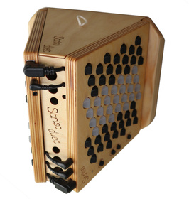

The Striso duet – a portable instrument based on the Striso board, inspired by concertina, bandoneon and accordion. This repository contains the design files and assembly instructions. For more information on the instrument see the https://www.striso.org/the-striso-duet/.

To encourage the design of custom instruments based on the Striso board the design files of the Striso duet are released as open source under the CERN Open Hardware Licence. We'd love to hear about your build experience, modifications or custom designs.

## Design
The duet is a wooden body on which two Striso boards can be mounted to play with two hands in a concertina/bandoneon/accordion style. The body is made from 3mm birch multiplex and the design is cut and engraved with a laser cutter.

The design is made in [Inkscape](www.inkscape.org), and is currently optimized for cutting almost 4 duets out of a 67x67cm board. For cutting 1 duet the parts should be repositioned. The black lines are cut, the blue lines are engraved, and the green lines are engraved out of focus, to have thicker lines.

The PCBs are designed in EasyEDA. (Normally I'd use KiCAD, but for these simple PCBs I was drawn to EasyEDA for its integrated fabrication service and related parts library).

## Assembly guide
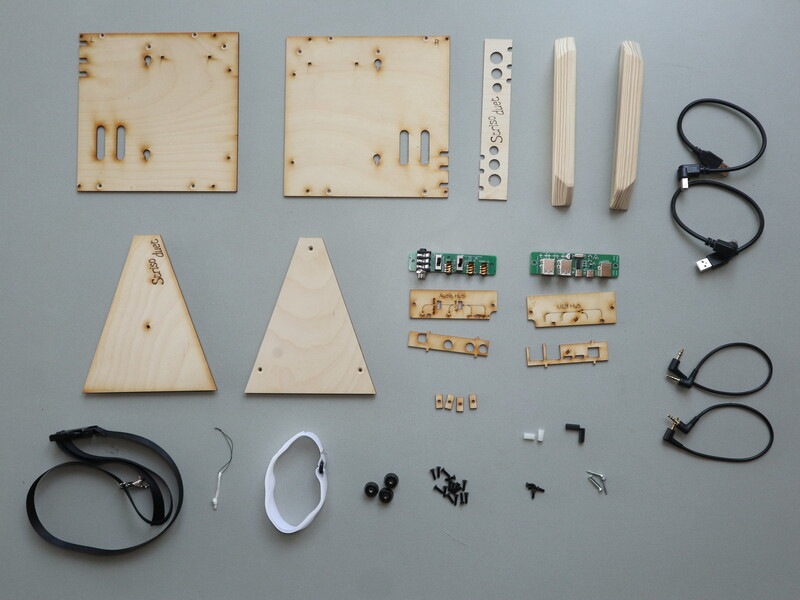

#### Part list:
- Lasercut parts: 2 sides, front, top, bottom, USB and audio PCB covers, PCB spacers. Top and bottom parts consist of 3 layers glued together.
- Palm rests: 22x30x194mm wood with chamfered corners and rounded edge
- Audio mixer hub PCB
- USB hub PCB
- 3x rubber feet (with 3mm flange nut inside)
- 15x M3 12mm countersunk hex screw
- 4x M3 8mm mushroom hex screw
- 2x M3 20mm standoff
- 2x M3 12mm standoff
- 4x 3mm wood screw
- 8x M3 square nut (already inserted in top and bottom panels while glueing) (hex nuts probably work fine too)
- 2x 20cm right angled USB-B cable
- 2x 20cm right angled 3.5mm jack cable
- Strap connection loop
- Neck strap
- Velcro strap for holding speaker or powerbank

#### Assembly steps
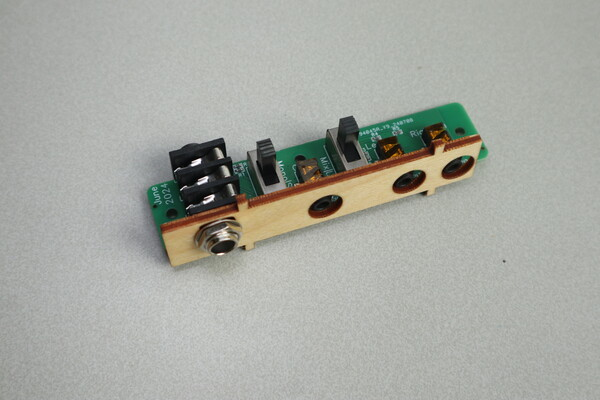\
Put the front panel on the audio PCB

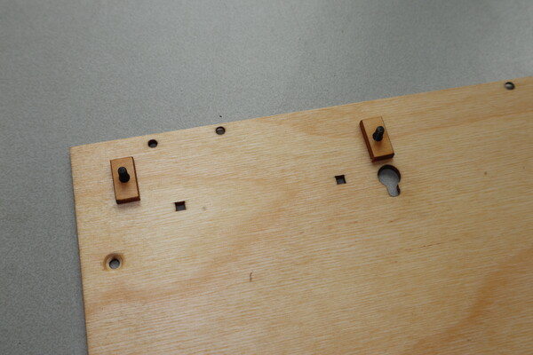\
Put 2 screws through the left side and add PCB spacers

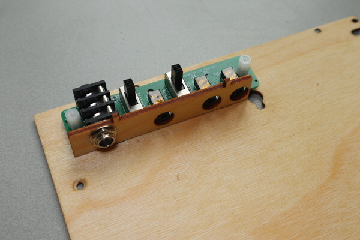\
Put the audio PCB assembly on top and fix it with 12mm standoffs

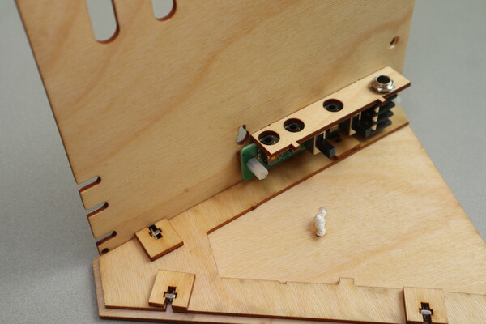\
Attach the top panel with 2 screws

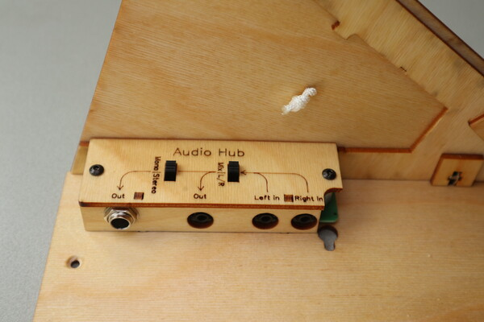\
Put the top panel on the audio PCB and fix with two M3 mushroom screws

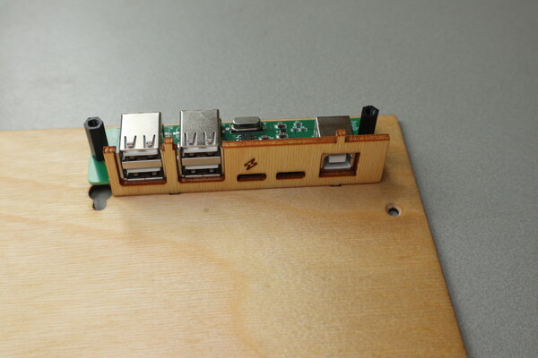 \
Repeat these steps for the USB PCB on the other side

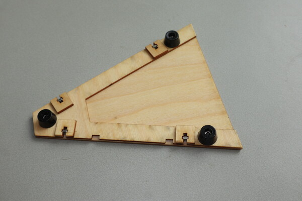\
Attach the rubber feet with 3 screws

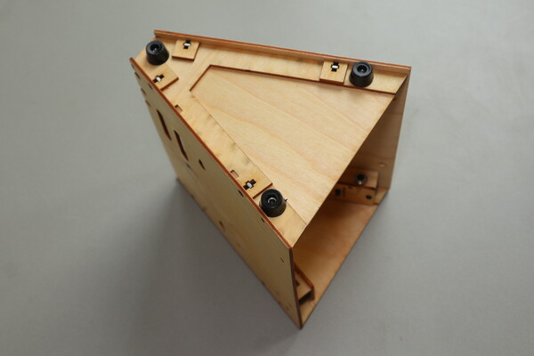\
Attach the bottom panel with 4 screws

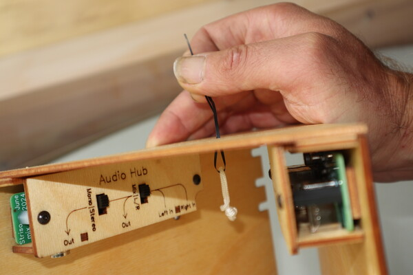 \
Pull the neck strap loop trough the top hole with a thin thread

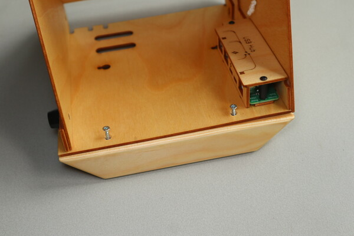\
Attach the palm rests with the wood screws

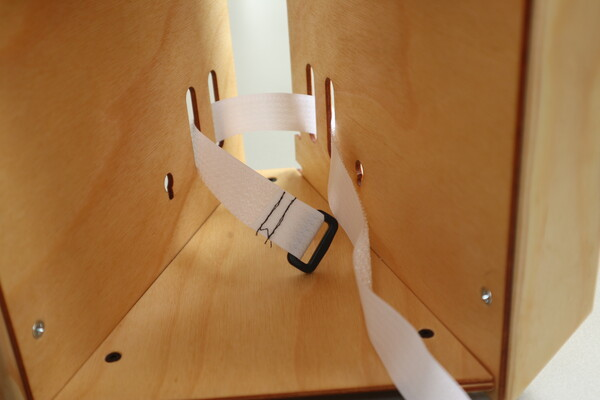\
Put the velcro strap through the slits

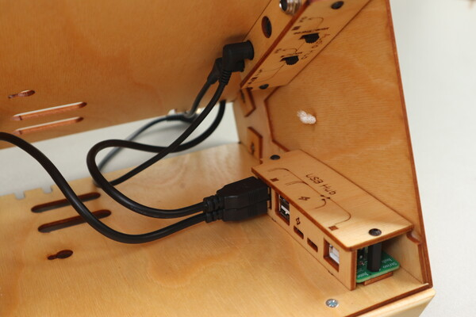\
Put the USB and audio cable in the hubs

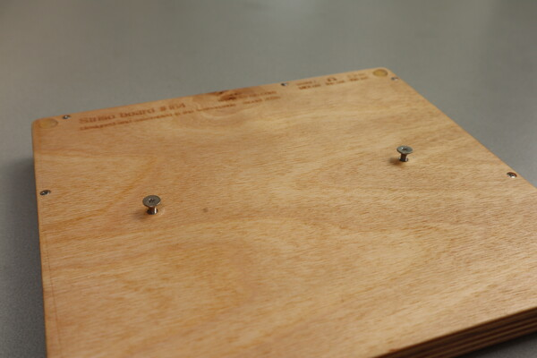\
Loosen the mounting screws on the back of the Striso board. Be careful to not push too hard on the loosened screws, otherwise the nuts can go inside the Striso board!

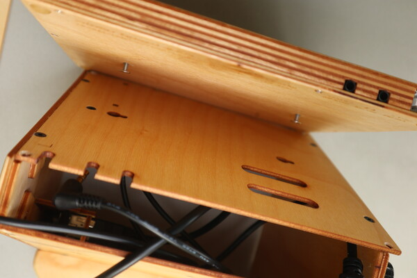\
Slide them into the keyholes and tighten them with a small philips screwdriver (PH1) (or just a bit in a bitholder)

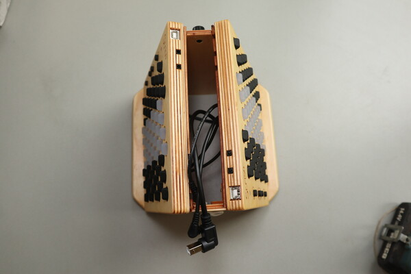\
Repeat for the second Striso board

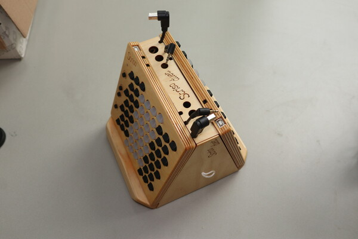\
Put the front into place with the cables through the holes

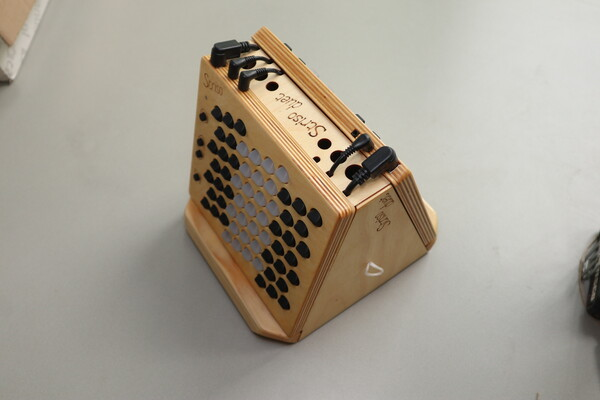\
Insert the cables in the Striso boards, this also holds the front in place. (In this picture the alternative audio routing is used)

Good luck!